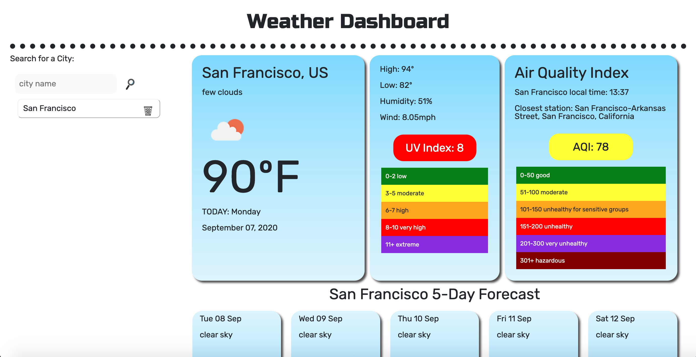

Weather Dashboard
1. user is able to search for city and get current weather details as well as a forecast for the next 5 days
1. when user refreshes page, previous search results remain on the page and user can click on them again to show weather details

[CLICK HERE FOR DEPLOYED APP](https://baytamo.github.io/06-weather/)

